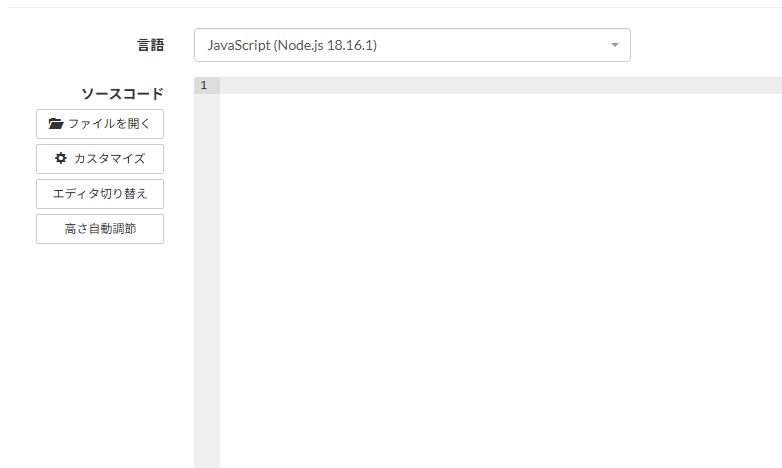

# AtCorder を JavasScript で始める方法

競技プログラミングの練習で AtCorder を始めてみたのですが、標準入力で躓いたのでメモです。

言語は Nodejs です。

AtCorder のアカウントを作成していざ、始めようと思いチュートリアルを開いて試行錯誤してたのですが、実行結果に問題がなかったのでいざコードを提出したところ全部エラーで帰ってきました。

なんでそうなっているのか分からずにその後も試行錯誤して提出を繰り返していたのですが、やはりずっとエラーになりました。

調べたところ、標準入力を受け取るためのモジュールが必要だったようです。(最初エディター真っ白だったし分かるわけ、、、)



そのため以下のような記述が最初に必要です。

```JavaScript
Main(require("fs").readFileSync("/dev/stdin", "utf8"));
```

それと Main じゃないと動かないのでこちらも注意。こちらのコードを記述して Main 関数を書けば正常に通りました。

なお、windows の場合も注意です。ローカルで試すときに改行コードがwindowsとでは異なる影響で提出したらエラーが出るというケースが僕はありました。この違いも覚えておいた方が良さそうです。
